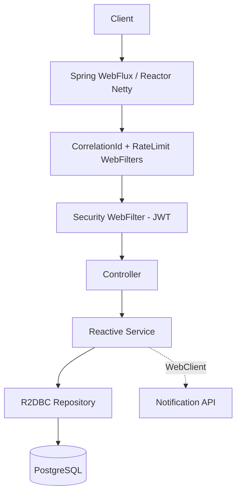
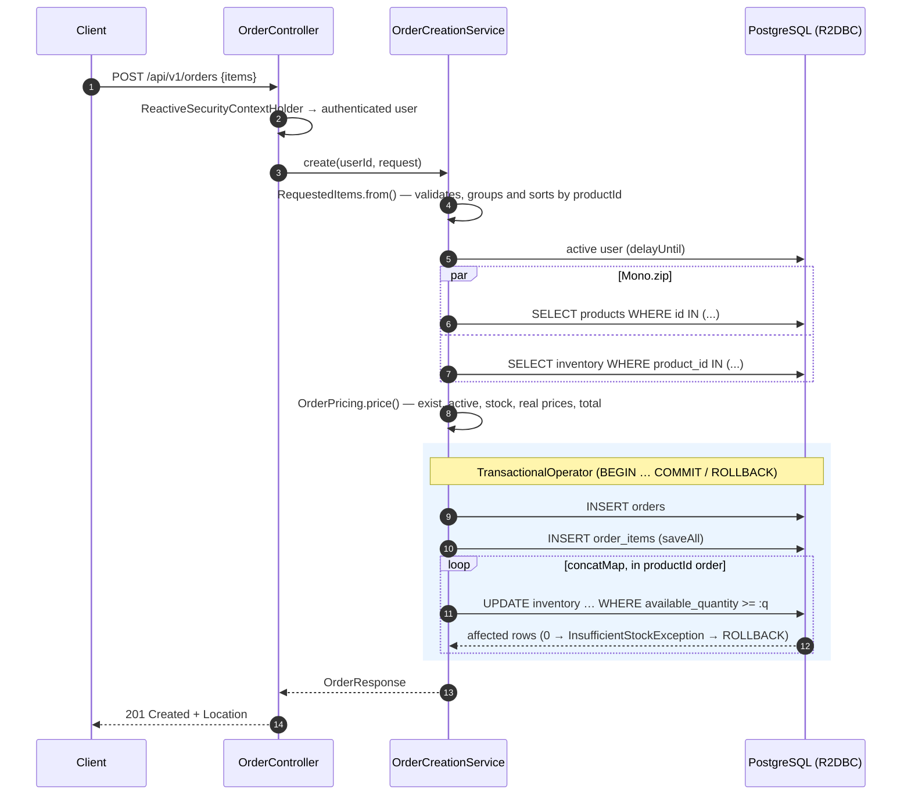

[🇪🇸 Español](README.md) | **🇬🇧 English**

# Reactive Order API

A **100% reactive** REST API for managing an online store's orders, built with **Java 21**, **Spring WebFlux**, **Project Reactor** and **R2DBC** on **PostgreSQL**.

Reactivity doesn't stop at the controllers: the whole chain, `HTTP → WebFlux → Service → R2DBC → PostgreSQL`, is non-blocking. The project shows operation composition with Reactor, reactive transactions, concurrency-safe stock management, WebClient with timeouts and retries, streaming with backpressure, JWT security adapted to WebFlux, and reactive testing with `StepVerifier` and Testcontainers.


---

## Contents

- [Features](#features)
- [Stack](#stack)
- [Architecture](#architecture)
- [Order creation flow](#order-creation-flow)
- [Requirements](#requirements)
- [Installation and running](#installation-and-running)
- [Environment variables](#environment-variables)
- [Trying the API with Swagger UI](#trying-the-api-with-swagger-ui)
- [Endpoints](#endpoints)
- [JWT and reactive security](#jwt-and-reactive-security)
- [Reactive Programming](#reactive-programming)
- [Mono / Flux](#mono--flux)
- [Concurrent composition](#concurrent-composition)
- [R2DBC](#r2dbc)
- [Reactive transactions](#reactive-transactions)
- [Stock concurrency](#stock-concurrency)
- [WebClient, timeout and retry](#webclient-timeout-and-retry)
- [Backpressure](#backpressure)
- [Reactive streaming](#reactive-streaming)
- [Error handling](#error-handling)
- [Correlation ID, logging and observability](#correlation-id-logging-and-observability)
- [Testing](#testing)
- [OpenAPI](#openapi)
- [Technical decisions](#technical-decisions)
- [Possible improvements](#possible-improvements)
- [Author](#author)
- [License](#license)

---

## Features

- **Orders priced on the backend**: the client only sends `productId` and `quantity`. Prices, subtotals and the total are computed from the database.
- **Reactive transaction**: the order, its lines and the stock reservation form a single atomic unit (`TransactionalOperator`).
- **No overselling**: stock reservation is an atomic `UPDATE ... WHERE available_quantity >= :quantity`. It is tested with truly simultaneous orders.
- **State machine**: `PENDING → CONFIRMED → PROCESSING → COMPLETED`, with cancellation that releases stock and optimistic concurrency control.
- **WebClient** calling a notification service, with a per-attempt **timeout** and a bounded **retry** with exponential backoff, only for transient errors.
- **NDJSON streaming** of products with end-to-end **backpressure**.
- **Reactive JWT security**: `SecurityWebFilterChain`, `AuthenticationWebFilter` and `ReactiveSecurityContextHolder`. `USER` and `ADMIN` roles, plus owner-based access control.
- **Request limit** (429) on sign-up and login against brute force.
- **Consistent errors** with a global `ErrorWebExceptionHandler`: 400, 401, 403, 404, 409, 422, 429, 500, 503 and 504.
- **Correlation ID** (`X-Correlation-ID`) propagated through the Reactor Context into the logs and outgoing calls.
- **Actuator** with `health`, `info` and `metrics`; sensitive endpoints are protected.
- **127 tests**: unit tests with `StepVerifier`, integration with a real PostgreSQL (Testcontainers), concurrency, rollback, security and WebClient.

## Stack

| Area | Technology |
|---|---|
| Language | Java 21 |
| Framework | Spring Boot 3.5, Spring WebFlux (Reactor Netty) |
| Reactive programming | Project Reactor (`Mono`, `Flux`), Micrometer Context Propagation |
| Persistence | Spring Data R2DBC, `r2dbc-postgresql`, PostgreSQL 16 |
| Migrations | Flyway (JDBC only at startup) |
| Security | Spring Security (WebFlux), JJWT 0.12, BCrypt |
| HTTP client | WebClient |
| Validation | Bean Validation |
| Observability | Spring Boot Actuator, SLF4J + MDC |
| Documentation | springdoc-openapi (WebFlux UI) |
| Testing | JUnit 5, Mockito, Reactor Test (`StepVerifier`, `TestPublisher`), WebTestClient, Testcontainers, MockWebServer |
| Deployment | Docker, Docker Compose, WireMock (simulated notifications) |

No JPA, Hibernate, JDBC for business data, `RestTemplate` or Lombok. DTOs and entities are immutable `record`s, so Lombok would add nothing.

## Architecture

Organized **by domain** (`auth`, `user`, `product`, `inventory`, `order`, `notification`). Each domain is layered: `controller → service → repository`.



```text
src/main/java/com/example/reactiveorderapi/
├── config/            # Transactions, Clock, OpenAPI, admin seed, context propagation
├── security/
│   ├── config/        # SecurityWebFilterChain, JSON 401/403 handlers
│   ├── jwt/           # JwtService, BearerTokenConverter, JwtAuthenticationManager
│   ├── ratelimit/     # Request limit on /api/v1/auth/**
│   ├── AuthenticatedUser.java
│   └── CurrentUser.java          # ReactiveSecurityContextHolder
├── auth/              # controller · service · dto
├── user/              # service · repository · entity · dto
├── product/           # controller · service · repository (+ dynamic search) · entity · dto
├── inventory/         # controller · service · repository (atomic UPDATEs) · entity · dto
├── order/             # controller · service (creation, pricing, states) · repository · entity · dto
├── notification/      # NotificationClient (WebClient + timeout + retry)
├── exception/         # Business exceptions + GlobalErrorWebExceptionHandler
└── common/            # ApiError, pagination, CorrelationIdFilter, policies
```

**Principles applied**

- Thin controllers: they only translate HTTP; the logic lives in small services (`OrderCreationService`, `OrderService`, `InventoryService`…).
- Pure logic separated from I/O: `OrderPricing` and `RequestedItems` never touch the database, are tested without mocks, and the reactive flow only orchestrates them.
- Immutability: entities and DTOs are `record`s; changes produce copies (`product.withActive(...)`).
- Constructor injection and an injected `Clock` so time is deterministic in tests.
- Specific business exceptions, each with its own HTTP code.

## Order creation flow



The 14 steps of the specification in the code (`order/service/OrderCreationService.java`):

```java
return Mono.fromCallable(() -> RequestedItems.from(request))          // 2. validate items
        .delayUntil(items -> userService.requireActiveUser(userId))   // 1. authenticated, active user
        .flatMap(this::priceOrder)                                     // 3-10. products, stock, prices, total
        .flatMap(priced -> persist(userId, priced));                   // 11-14. order + items + reservation (transaction)
```

## Requirements

- **Docker** and **Docker Compose** to run the full environment.
- **Java 21** to run it locally. There's no need to install Maven because the wrapper (`./mvnw`) is included.
- Docker is also required for the integration tests (Testcontainers).

## Installation and running

### With Docker (recommended)

```bash
git clone https://github.com/samsenpro/reactive-order-api.git
cd reactive-order-api
cp .env.example .env        # edit DB_PASSWORD, JWT_SECRET, ADMIN_EMAIL and ADMIN_PASSWORD
docker compose up --build
```

Docker Compose starts three services:

| Service | Port | Description |
|---|---|---|
| `reactive-order-api` | `8080` | The API. Waits for PostgreSQL to be *healthy* and applies migrations on startup. |
| `postgres` | internal | PostgreSQL 16 with a persistent volume and a healthcheck. |
| `notification-service` | `8081` | Notification service simulated with **WireMock**; responds `202` to `POST /notifications`. |

- API: http://localhost:8080
- Swagger UI: http://localhost:8080/swagger-ui.html
- Health: http://localhost:8080/actuator/health
- Requests received by the mock: http://localhost:8081/__admin/requests

To shut it down: `docker compose down` (keeps the data) or `docker compose down -v` (also deletes the database).

### Locally

```bash
docker compose up -d postgres notification-service
export DB_USERNAME=postgres DB_PASSWORD=change_me JWT_SECRET="$(openssl rand -base64 48)" \
       NOTIFICATION_SERVICE_URL=http://localhost:8081
./mvnw spring-boot:run
```

On Windows (PowerShell):

```powershell
$env:DB_USERNAME="postgres"; $env:DB_PASSWORD="change_me"; $env:JWT_SECRET="<32+ byte secret>"; $env:NOTIFICATION_SERVICE_URL="http://localhost:8081"
.\mvnw.cmd spring-boot:run
```

> To run it locally, publish the PostgreSQL port by adding `ports: ["5432:5432"]` to the `postgres` service, or use your own instance.

## Environment variables

Every credential is read from environment variables. `.env` is in `.gitignore` and is **never** committed to the repository.

| Variable | Required | Description | Default |
|---|---|---|---|
| `DB_HOST` | No | PostgreSQL host | `localhost` (`postgres` in Compose) |
| `DB_PORT` | No | PostgreSQL port | `5432` |
| `DB_NAME` | No | Database | `reactive_orders` |
| `DB_USERNAME` | **Yes** | Database user | — |
| `DB_PASSWORD` | **Yes** | Database password | — |
| `JWT_SECRET` | **Yes** | HMAC key of at least 32 bytes; the app won't start if it's shorter | — |
| `JWT_EXPIRATION` | No | Token lifetime in seconds | `3600` |
| `NOTIFICATION_SERVICE_URL` | No | Notification service URL | `http://localhost:8081` |
| `NOTIFICATION_TIMEOUT` | No | Timeout of each attempt | `2s` |
| `NOTIFICATION_MAX_RETRIES` | No | Retries after the first attempt | `2` |
| `NOTIFICATION_RETRY_BACKOFF` | No | Initial wait between retries (exponential) | `200ms` |
| `AUTH_RATE_LIMIT` | No | Requests per IP to `/api/v1/auth/**` per window | `10` |
| `AUTH_RATE_LIMIT_WINDOW` | No | Window length | `1m` |
| `ADMIN_EMAIL` / `ADMIN_PASSWORD` | No | Initial administrator; created on startup if it doesn't exist | — |
| `ADMIN_NAME` | No | Initial administrator name | `Administrator` |
| `APP_PORT` / `NOTIFICATION_PORT` | No | Ports published by Compose | `8080` / `8081` |

To generate a secret: `openssl rand -base64 48`.

## Trying the API with Swagger UI

Swagger is not published on the internet: it is served by **your own instance**. Anyone who clones the repository and runs `docker compose up --build` gets it at http://localhost:8080/swagger-ui.html.

**1. Start with an administrator.** In `.env` set `ADMIN_EMAIL=admin@demo.local` and `ADMIN_PASSWORD=AdminDemo123`. The password must have 8 or more characters, with at least one uppercase letter, one lowercase letter and one number.

**2. Create a user and get a token**

1. **Authentication → `POST /api/v1/auth/register`** → *Try it out* → *Execute*. The example body is already filled in. Response: `201`.
2. **`POST /api/v1/auth/login`** with the same credentials. Response: `200` with `accessToken`.
3. Click **Authorize** 🔓 and paste the token **without** the `Bearer` prefix.

**3. Create products (as administrator)**

1. Log in with `ADMIN_EMAIL` / `ADMIN_PASSWORD` and authorize Swagger with that token.
2. `POST /api/v1/products` with `{"name": "Mechanical Keyboard", "sku": "KB-001", "price": 89.90, "initialStock": 5}` → `201`.

**4. Place an order and watch the stock**

| Step | Endpoint | Body | Result |
|---|---|---|---|
| Create order | `POST /api/v1/orders` | `{"items":[{"productId":1,"quantity":2}]}` | `201`, `PENDING`, computed total |
| Check stock | `GET /api/v1/inventory/1` | — | `available` 3, `reserved` 2 |
| Out of stock | `POST /api/v1/orders` | `{"items":[{"productId":1,"quantity":10}]}` | `409 Insufficient stock` |
| Confirm (ADMIN) | `PATCH /api/v1/orders/1/status` | `{"status":"CONFIRMED"}` | `200` + notification sent to WireMock |
| Cancel | `PATCH /api/v1/orders/1/status` | `{"status":"CANCELLED"}` | `200`, the stock returns to `available` |

**5. Check the security**

| Test | Result |
|---|---|
| *Authorize → Logout* and call `GET /api/v1/orders` | `401` |
| As `USER`, `POST /api/v1/products` | `403` |
| As another `USER`, `GET /api/v1/orders/{id}` for someone else's order | `404` |
| As `ADMIN`, the same order | `200` |

**6. Streaming.** Swagger doesn't render streams well, so use curl:

```bash
curl -N -H "Authorization: Bearer $TOKEN" -H "Accept: application/x-ndjson" \
     http://localhost:8080/api/v1/products/stream
```

## Endpoints

### Authentication (public)

| Method | Route | Description | Response |
|---|---|---|---|
| POST | `/api/v1/auth/register` | Register a user (`USER`) | `201` |
| POST | `/api/v1/auth/login` | Get a JWT | `200` `{accessToken, tokenType, expiresIn}` |

### Products

| Method | Route | Role | Description |
|---|---|---|---|
| POST | `/api/v1/products` | ADMIN | Create a product and its inventory (`initialStock`) in one transaction |
| GET | `/api/v1/products?name=&sku=&active=&minPrice=&maxPrice=&page=&size=` | USER | Filtered, paginated listing |
| GET | `/api/v1/products/stream` | USER | Active products as **NDJSON** |
| GET | `/api/v1/products/{id}` | USER | Detail |
| PUT | `/api/v1/products/{id}` | ADMIN | Update |
| PATCH | `/api/v1/products/{id}/activate` | ADMIN | Activate |
| PATCH | `/api/v1/products/{id}/deactivate` | ADMIN | Deactivate (can no longer be sold) |
| DELETE | `/api/v1/products/{id}` | ADMIN | Delete (`409` if it has orders: deactivate it instead) |

### Inventory

| Method | Route | Role | Description |
|---|---|---|---|
| GET | `/api/v1/inventory/{productId}` | USER | Available and reserved stock |
| PATCH | `/api/v1/inventory/{productId}/add` | ADMIN | `{"quantity": n}` adds available units |
| PATCH | `/api/v1/inventory/{productId}/remove` | ADMIN | `{"quantity": n}` removes available units (`409` if it would go negative) |

### Orders

| Method | Route | Description |
|---|---|---|
| POST | `/api/v1/orders` | Create an order (reserves stock) |
| GET | `/api/v1/orders?userId=&page=&size=` | USER: their orders. ADMIN: all, or those of `userId` |
| GET | `/api/v1/orders/{id}` | Own order (USER) or any (ADMIN). Someone else's → `404` |
| PATCH | `/api/v1/orders/{id}/status` | ADMIN: any valid transition. USER: only cancel their `PENDING`/`CONFIRMED` orders |
| DELETE | `/api/v1/orders/{id}` | Delete a `PENDING` (releases stock) or `CANCELLED` order |

**States:**

```text
PENDING ──► CONFIRMED ──► PROCESSING ──► COMPLETED
   │            │              │
   └────────────┴──────────────┴──► CANCELLED
```

- On **cancel**, the reserved stock becomes available again.
- On **complete**, the reserved stock is permanently deducted.
- On **confirm**, the external service is notified.

### Operational

| Route | Access |
|---|---|
| `/actuator/health` (+ `/liveness`, `/readiness`) | Public; details only shown to ADMIN |
| `/actuator/info`, `/actuator/metrics` | ADMIN |
| `/swagger-ui.html`, `/v3/api-docs` | Public |

## JWT and reactive security

The configuration is built for WebFlux; it's not an adaptation of the Spring MVC one (`security/config/SecurityConfig.java`):

| Piece | What it does |
|---|---|
| `SecurityWebFilterChain` + `ServerHttpSecurity` | Authorization rules by route and method. |
| `NoOpServerSecurityContextRepository` | **Stateless**: no `WebSession` is created and the context isn't stored between requests. |
| `BearerTokenConverter` | Extracts `Authorization: Bearer <token>` from the `ServerWebExchange`. Without the header, the request continues as anonymous. |
| `JwtAuthenticationManager` | Validates the HS256 signature, issuer and expiration, and **loads the user from the DB** on every request: disabling or deleting an account invalidates its tokens immediately. |
| `AuthenticationWebFilter` | Ties the two above together. If the token is invalid it responds `401` in JSON. |
| `ReactiveSecurityContextHolder` (`CurrentUser`) | Reads the user from the **Reactor Context**; WebFlux has no per-request `ThreadLocal`. |
| `@EnableReactiveMethodSecurity` + `@PreAuthorize` | Defense in depth on ADMIN endpoints; works with methods returning `Mono`. |

**Other decisions**

- **CSRF disabled, with justification.** Only `Authorization: Bearer` is used, with no session cookies, so there are no credentials the browser sends automatically.
- **BCrypt off the event loop.** The hash (~100 ms of CPU) runs on `Schedulers.boundedElastic()`, both on sign-up and login.
- **No user enumeration.** An unknown email, a wrong password and a disabled account all return the same `401 Invalid email or password`.
- **Horizontal authorization.** The user id always comes from the token. Someone else's order responds `404` so as not to reveal which ids exist.
- **Request limit.** There's a maximum number of requests per IP to `/api/v1/auth/**` (`429` + `Retry-After`).

## Reactive Programming

Each operator is explained with the place in the project where it's used and why.

| Operator | Where | Why |
|---|---|---|
| **`Mono`** | Almost every service, e.g. `ProductService.findById` | The operation produces **0 or 1** result asynchronously. `Mono<Void>` means "finished successfully" with no value, as in `InventoryService.reserve`. |
| **`Flux`** | `ProductRepository.findAllByActiveTrueOrderByIdAsc`, `OrderItemRepository.findAllByOrderId…` | **0..N** elements that arrive as the DB sends them, without loading the whole list into memory. |
| **`map`** | `productRepository.findById(id).map(ProductResponse::from)` | **Synchronous** 1→1 transformation (entity → DTO), with no I/O. |
| **`flatMap`** | `.flatMap(priced -> persist(userId, priced))` in `OrderCreationService` | Chains another **asynchronous** operation that returns a `Mono`/`Flux`. With `map` you'd get a `Mono<Mono<T>>`. |
| **`filter`** | `UserService.requireActiveUser`: `.filter(User::enabled)`; `JwtAuthenticationManager`: `.filter(UserDetails::isEnabled)` | Drops the value if it doesn't meet the condition: a disabled user becomes an empty `Mono`. |
| **`switchIfEmpty`** | Next to the `filter` above, and in every `findById`: `.switchIfEmpty(Mono.error(() -> new ProductNotFoundException(id)))` | Turns "no result" into a business error (404). `Mono.error` takes a *supplier* so the exception isn't created unless needed. |
| **`onErrorResume`** | `OrderService.notifyIfConfirmed` | If the notification fails after the retries, it's logged and the flow continues with `Mono.empty()`. An external failure doesn't undo an already-confirmed order. |
| **`onErrorMap`** | `AuthService.login`, `ProductService.create` | Translates technical errors into domain errors: `AuthenticationException` → generic 401; `DuplicateKeyException` → duplicate SKU (409). |
| **`timeout`** | `NotificationClient.sendOrderConfirmed` | Cuts **each attempt** at 2 s. When the subscription is cancelled, Reactor Netty releases the connection and nothing is left hanging. |
| **`retryWhen`** | `NotificationClient` with `Retry.backoff(2, 200ms).filter(isTransient)` | **Bounded** retries, with exponential backoff and jitter, only for transient errors. [See details](#webclient-timeout-and-retry). |
| **`zip`** | `OrderCreationService.priceOrder` and `ProductService.search` | Runs two independent queries **in parallel** (products and inventory; page and total) and combines the results when both finish. |
| **`zipWhen`** | `OrderCreationService.persist`: `save(order).zipWhen(order -> saveItems(order.id(), …))` | The second operation **depends** on the result of the first (it needs the generated id) and both values are kept. |
| **`delayUntil`** | `.delayUntil(items -> userService.requireActiveUser(userId))` | Waits for an asynchronous check to finish without changing the value flowing through. If it fails, the error cuts the chain. |
| **`collectList` / `collectMap` / `collectMultimap`** | `collectMap(Product::id)` in pricing; `collectMultimap(OrderItem::orderId)` when paginating orders | Gathers a `Flux` when the next step needs **all** the elements: computing the total or distributing items among the page's orders. |
| **`concatMap`** | Stock reservations, release on cancel | Processes elements **one after another and in order**. [See why](#concurrent-composition). |
| **`limitRate`** | `ProductService.streamActiveProducts` | Controls the demand requested upstream. [See Backpressure](#backpressure). |
| **`deferContextual` / `contextWrite`** | `CorrelationIdFilter` writes to the Context and `NotificationClient` reads it | Passes request data (the correlation ID) without a `ThreadLocal`. |
| **`as(transactionalOperator::transactional)`** | Order and product creation, status changes, deletions | Delimits **explicitly** which part of the chain is transactional. |

**What is avoided:** no `block()`, `Thread.sleep()`, JDBC in business logic, `RestTemplate` or blocking file I/O. Domain validations that throw exceptions are wrapped in `Mono.fromCallable(...)`, so they arrive as an **error signal** and not as an exception that breaks the chain's assembly.

## Mono / Flux

- `Mono<OrderResponse> create(...)`: a single order.
- `Mono<PageResponse<ProductResponse>> search(...)`: a page is a single value grouping a list, because the total needs to be known.
- `Flux<ProductResponse> streamActiveProducts()`: a stream of unknown size.
- Repositories return `Mono<Product> findById`, `Flux<Inventory> findAllByProductIdIn`, `Mono<Long> reserve(...)` (affected rows).

## Concurrent composition

Concurrency is used where it's safe and avoided where it could break consistency. **Stock consistency takes priority over performance.**

| Operator | Use in the project | Reason |
|---|---|---|
| `Mono.zip` | Products ∥ inventory; page ∥ total | They're **independent reads** outside the transaction. Each one takes its own connection from the pool, so the total latency is that of the slowest one, not the sum of both. |
| `concatMap` | Reserving, releasing and consuming stock | Inside a transaction every statement shares **a single connection**; PostgreSQL doesn't run two statements at once on the same connection. Also, reserving **in `productId` order** makes every order lock the rows in the same order, which **prevents deadlocks**. |
| `flatMap` | Chaining dependent steps (`Mono` → `Mono`) | Natural sequential composition of a single value. |
| `flatMapSequential` | **Not used, on purpose** | It would load each page order's items in parallel while keeping the order, but that's N queries (the N+1 problem). A **single** `IN (...)` query + `collectMultimap` is used instead. |
| `collectList` | Saved items, results page | The next step needs the full collection. |

## R2DBC

- **All** business persistence goes through **Spring Data R2DBC** with the non-blocking `r2dbc-postgresql` driver and a connection pool (`r2dbc-pool`).
- Entities are immutable `record`s with `@Table` and `@Id`. A null id means a new entity, and when saved R2DBC returns a copy with the generated id.
- **Derived queries** (`findAllByUserId(Long, Pageable)`), **`@Query` + `@Modifying`** for the atomic stock `UPDATE`s, and **`R2dbcEntityTemplate` + `Criteria`** for the search with optional filters (`ProductSearchRepository`). Values are always bound parameters and `LIKE` wildcards are escaped.
- R2DBC has no `Page`: pagination uses `LIMIT/OFFSET` with a fixed server-side order, and the total is queried in parallel.

**Flyway and the JDBC/R2DBC split.** Flyway only works over JDBC, so it's configured with its own URL (`spring.flyway.url=jdbc:postgresql://...`) and runs **once at startup**, before accepting requests. Spring Boot **doesn't create a `DataSource`** when an R2DBC `ConnectionFactory` exists, so no service can use JDBC by mistake. The Actuator health only shows the `r2dbc` indicator.

Migrations (`src/main/resources/db/migration`):

- **Tables**: `users`, `products`, `inventory`, `orders`, `order_items`.
- **Indexes**: `users.email` (unique), `products.sku` (unique), `products.active`, `inventory.product_id` (unique), `orders.user_id`, `orders.status` and `order_items.order_id`.
- **CHECK constraints**: price > 0, stock ≥ 0, subtotal = quantity × price, valid states.

## Reactive transactions

Spring MVC transactions (`@Transactional` over JDBC) rely on a `ThreadLocal` holding the connection. In WebFlux a single request can switch threads at every operator, so that mechanism doesn't work.

The project uses **`TransactionalOperator`** on the **`R2dbcTransactionManager`** (a `ReactiveTransactionManager`):

```java
return orderRepository.save(Order.pending(userId, total, now))
        .zipWhen(order -> saveItems(order.id(), priced))          // INSERT order_items
        .delayUntil(saved -> reserveStock(saved.getT1().id(), priced))  // UPDATE inventory …
        .map(saved -> OrderResponse.from(saved.getT1(), saved.getT2()))
        .as(transactionalOperator::transactional);
```

**How it works:**

1. On subscription, the operator takes a connection from the pool, runs `BEGIN` and stores the connection in the **Reactor Context**, not in a `ThreadLocal`.
2. Every repository running inside that chain finds the connection in the Context and **reuses** it, whatever the thread.
3. If the chain completes successfully, it runs `COMMIT`. If **any error signal** arrives, for example `InsufficientStockException` on the second reservation, it runs `ROLLBACK`. It also rolls back if the client **cancels** the request.

The case this prevents (order created → items created → stock fails → inconsistent data) is **tested with a real PostgreSQL** in `StockConcurrencyIntegrationTest.failedReservationRollsBackOrderItemsAndPreviousReservations`:

- 10 simultaneous orders ask for A (plentiful) and B (1 unit).
- The logs show **10 reservations of A** inside the transactions, but only 1 of B.
- At the end there's **1 order**, **1 line**, and A has exactly **1 reserved unit**: the other 9 transactions were fully rolled back.

Only the writes go inside the transaction. The preceding reads (products and inventory) happen outside and in parallel, to keep the transaction as short as possible.

## Stock concurrency

**The problem.** With stock 5, users A and B order 4 units at the same time. The naive pattern is `SELECT stock → if (stock >= 4) → UPDATE`: both read 5, both pass the check and the stock ends at −3.

**The solution.** The check and the change are **a single atomic statement** (`inventory/repository/InventoryRepository.java`):

```sql
UPDATE inventory
   SET available_quantity = available_quantity - :quantity,
       reserved_quantity  = reserved_quantity + :quantity,
       updated_at         = now()
 WHERE product_id = :productId
   AND available_quantity >= :quantity
```

**Why it's safe:**

- PostgreSQL takes a **row lock** for the `UPDATE`. If two transactions compete, the second **waits** for the first to finish and then **re-evaluates the `WHERE`** with the updated value.
- If there's no stock left, the `UPDATE` affects **0 rows**. The service detects it and emits `InsufficientStockException` (409), which rolls back the whole order.
- As a last line of defense, the table has `CHECK (available_quantity >= 0)`.
- Reservations are made **sorted by `productId`** to avoid deadlocks between orders with several products.
- Status changes use **optimistic concurrency**: `UPDATE orders SET status = :target WHERE id = :id AND status = :expected`. So two simultaneous cancellations can't release the stock twice (the second one gets `409`).

The earlier stock check (`OrderPricing`) is just a **fail-fast** that gives a good error message. The real guarantee is the `UPDATE`.

**Tested** in `StockConcurrencyIntegrationTest` with truly parallel HTTP requests:

- Stock 5 and 2 × 4 units → 1 order created and 1 rejected (`409`); 1 unit left.
- Stock 10 and 25 simultaneous 1-unit orders → exactly 10 created and 15 rejected; final stock 0, never negative.

## WebClient, timeout and retry

When an order moves to `CONFIRMED`, `NotificationClient` sends `POST /notifications` to the external service. In Docker it's a WireMock mock.

```java
Mono.deferContextual(ctx -> webClient.post().uri("/notifications")
            .header("X-Correlation-ID", ctx.getOrDefault("correlationId", ""))
            .bodyValue(notification)
            .retrieve()
            .toBodilessEntity()
            .timeout(properties.timeout()))                       // per attempt
    .retryWhen(Retry.backoff(maxRetries, backoff).filter(NotificationClient::isTransient))
```

| Aspect | Decision |
|---|---|
| **Timeout** | 2 s **per attempt** (`timeout` before `retryWhen`), plus `responseTimeout` and a connect timeout in Reactor Netty. When it expires, the subscription is cancelled and the connection released. |
| **Which operation retries** | Only the notification. **Never** order or stock writes: retrying them could duplicate effects. |
| **Why** | It's a network call to a third party: transient failures (network, restarts, overload) are expected and a retry usually fixes them. |
| **How many attempts** | 1 attempt + **2 retries** (configurable), with exponential backoff from 200 ms and jitter. Never infinite. |
| **Which errors are retried** | `TimeoutException`, connection errors (`WebClientRequestException`), **5xx** and **429**. |
| **Which errors are NOT retried** | **400, 401, 403, 404** and the other 4xx: repeating a wrong or unauthorized request doesn't fix it. |
| **After the attempts run out** | `NotificationDeliveryException`. `OrderService` catches it with `onErrorResume`, logs `External notification failure orderId=… userId=…` and the order **stays confirmed**. |

Verified live with Docker: with WireMock responding in 5 s, the confirmation took ~6.9 s (3 attempts of 2 s + backoff), returned `200 CONFIRMED` and WireMock recorded exactly 3 requests.

## Backpressure

**What is it?** It's the ability of the **consumer** to tell the **producer** how many elements it can handle. In Reactive Streams the subscriber calls `request(n)` and the producer can't emit more than `n`.

**Why does it matter?** Without backpressure, a fast producer (a table with millions of rows) overwhelms a slow consumer (a mobile client on a bad connection). The application piles up data in memory until it runs out of heap, or has to drop it.

**How does Reactor handle it in this project?** With `GET /api/v1/products/stream`:

```text
Slow HTTP client ◄── TCP (window) ◄── Reactor Netty ◄── limitRate(50) ◄── R2DBC Flux ◄── PostgreSQL
```

1. Reactor Netty only requests more elements from the `Flux` once it has written the previous ones to the socket. If the client reads slowly, the TCP buffer fills up and demand stops.
2. `limitRate(50)` turns that demand into **bounded** requests to the source: it asks for 50 rows and replenishes once 75% have been consumed. It never requests `Long.MAX_VALUE`, i.e. "everything".
3. The PostgreSQL R2DBC driver carries the demand into the protocol and **only reads the requested rows from the DB**.

The result is constant memory usage, whatever the size of the table. The test `ProductServiceTest.Stream.consumerDemandIsPropagatedInBoundedBatches` uses a `TestPublisher` to check that the subscriber requests 2 elements and the source never receives a demand larger than the batch, and that cancellation reaches the source.

**Operators that affect backpressure**

| Operator | Effect |
|---|---|
| `limitRate(n)` | Bounds and batches the demand going upstream. It's the one this project uses. |
| `buffer`, `window` | Group elements and change the granularity of demand. |
| `flatMap(f, concurrency, prefetch)` | Concurrency and *prefetch* determine how many elements it requests in advance. |
| `concatMap` | Processes one at a time: demand is minimal. |
| `publishOn(scheduler, prefetch)` | Introduces a queue of *prefetch* capacity when switching threads. |
| `onBackpressureBuffer`, `onBackpressureDrop`, `onBackpressureLatest` | Strategies for sources that **don't** honor demand (events, *hot publishers*): buffer, drop or keep the latest. |

No `onBackpressure*` is used here because the source, the database, **does** honor demand. There's no need to drop or buffer.

## Reactive streaming

`GET /api/v1/products/stream` returns `Flux<ProductResponse>` as **`application/x-ndjson`**: one JSON object per line, sent as soon as it's available.

A streaming endpoint is useful because:

- The client starts processing the first element without waiting for the last one (lower *time-to-first-byte*).
- The server doesn't build a giant list in memory (thanks to the backpressure described above).
- It suits exports, catalog synchronization or integrations that consume data incrementally.

NDJSON was chosen over Server-Sent Events because every line is a self-contained JSON, easy to consume with `curl`, `jq` or any language, and there's no need to keep the connection open for future events.

## Error handling

`GlobalErrorWebExceptionHandler` implements `ErrorWebExceptionHandler` with `@Order(-2)`, ahead of Spring Boot's. It covers errors from the controllers **and** from the `WebFilter`s. The security handlers (401/403) use the same `ApiErrorWriter`, so every response has the same format:

```json
{
  "timestamp": "2026-09-23T20:00:00Z",
  "status": 404,
  "error": "NOT_FOUND",
  "message": "Product not found: 100",
  "path": "/api/v1/products/100",
  "correlationId": "4c1f0c7e-2b8a-4a57-9a8e-8f5b1e2d9c10"
}
```

| Code | Source |
|---|---|
| `400` | Bean Validation (with per-field `errors[]`), malformed JSON, invalid parameters, inconsistent price range |
| `401` | No token, invalid or expired token, disabled account, wrong credentials |
| `403` | Insufficient role (`AccessDeniedException`) |
| `404` | `ProductNotFoundException`, `OrderNotFoundException` (also for other users' orders), `UserNotFoundException` |
| `409` | `InsufficientStockException`, `DuplicateResourceException` (email/SKU), `ProductInUseException`, `OrderConflictException` |
| `422` | `ProductInactiveException`, `InvalidOrderException`, `InvalidStatusTransitionException` |
| `429` | `RateLimitExceededException` (+ `Retry-After` header) |
| `500` | Unexpected error: logged with the stack trace; the client gets a generic message |
| `503` | Database unavailable (`DataAccessResourceFailureException`, transient R2DBC errors) |
| `504` | `TimeoutException` from a downstream operation |

Stack traces and internal messages are **never** exposed.

## Correlation ID, logging and observability

**Correlation ID.** `CorrelationIdFilter` is the first `WebFilter`:

- Keeps the client's `X-Correlation-ID` if it's valid (`[A-Za-z0-9._-]{1,64}`, which prevents log injection). Otherwise it generates a UUID.
- Returns it in the response header and in the body of errors.
- Stores it in the **Reactor Context**. With `spring.reactor.context-propagation=auto` and a registered `ThreadLocalAccessor` (`ContextPropagationConfig`), Micrometer copies it into the **MDC** at every operator, whatever the thread.
- `NotificationClient` forwards it to the external service, so a request can be traced across systems.

```text
INFO [cid:abc-123] ... OrderService : Order status changed orderId=3 userId=10 PENDING -> CONFIRMED
WARN [cid:abc-123] ... NotificationClient : Retrying notification orderId=3 attempt=1 cause=TimeoutException
```

**Logged events** (with `orderId`/`userId`): user registered, login, order created, stock reserved/released/consumed, order confirmed, status change, retries and external notification failure.

**Data never logged:** passwords, JWTs, the `Authorization` header or secrets. The `toString()` of sensitive DTOs and entities omits them.

**Actuator**

| Endpoint | Access | Content |
|---|---|---|
| `health` | Public | Overall status; `liveness`/`readiness` for orchestrators. Details (R2DBC, disk) are only visible to ADMIN. |
| `info` | ADMIN | Version and *build* (`build-info`), Java, OS and app description |
| `metrics` | ADMIN | JVM, HTTP (`http.server.requests`), R2DBC pool metrics… |

## Testing

```bash
./mvnw test     # 127 tests; Docker must be running
```

**Unit (84): JUnit 5 + Mockito + Reactor Test**

| Class | What it tests |
|---|---|
| `ProductServiceTest` | **Mono**: success, empty → 404, repository error. **Flux**: several elements, empty, error mid-stream, **backpressure** with `TestPublisher`. Search with `zip`, duplicate SKU, deletion with FK |
| `InventoryServiceTest` | Atomic reservation OK/insufficient; difference between "out of stock" and "product doesn't exist" |
| `OrderCreationServiceTest` | Full flow inside the transaction; **reservation order** (`InOrder`); propagated reservation error (rollback); missing or inactive product; invalid user; validation arrives as an error signal |
| `OrderServiceTest` | Own/other/admin access; pagination without N+1; cancel releases and complete consumes stock; invalid transition; USER can't confirm; optimistic conflict; tolerated notification failure |
| `OrderPricingTest`, `RequestedItemsTest`, `OrderStatusTest` | Pure logic: prices, rounding, line grouping, limits and the state machine |
| `NotificationClientTest` | **WebClient** against `MockWebServer`: success, **timeout**, **500 error**, **retry**, **success after retry**, no retry on 400 and correlation ID propagation |
| `AuthServiceTest`, `JwtServiceTest`, `JwtAuthenticationManagerTest` | Sign-up, generic login, duplicate-email race; expired, tampered, other-key or other-issuer JWT; disabled or deleted user |
| `FixedWindowRateLimiterTest`, `CorrelationIdFilterTest` | Limiter windows; correlation ID in the Reactor Context |

**Integration (43): Testcontainers + WebTestClient.** A **real PostgreSQL 16** starts in a container (not H2) and the full application runs on a random port. `@ServiceConnection` configures both R2DBC and Flyway (JDBC), and the same container is shared across classes.

| Class | What it tests |
|---|---|
| `AuthIntegrationTest` | Sign-up, duplicates, validation, login, generic errors, correlation ID |
| `ProductIntegrationTest` | Create (with inventory), read, update, delete, filters + pagination, escaped `LIKE`, **NDJSON stream**, product with orders |
| `InventoryIntegrationTest` | Create inventory, add and remove stock, never negative, permissions |
| `OrderIntegrationTest` | Create order, **client price ignored**, reserve stock, read, **update status** up to `COMPLETED`, **notification received** with correlation ID, tolerated notification failure (3 attempts), cancel, invalid transitions, deletion |
| `StockConcurrencyIntegrationTest` | **Overselling impossible** with parallel HTTP requests and **full rollback** of the losing transactions |
| `SecurityIntegrationTest` | No JWT → 401 · invalid or tampered JWT → 401 · USER on allowed endpoints → 200 · USER on ADMIN endpoint → 403 · USER with own order → 200 · USER with someone else's order → 404 · ADMIN with someone else's order → 200 · Actuator and Swagger |
| `AuthRateLimitIntegrationTest` | `429` + `Retry-After` when the limit is exceeded |

**Why `MockWebServer` and not WireMock in the tests:** it's a small dependency that starts a real HTTP server and lets you queue responses (`500` then `202`) and delay them to trigger timeouts, which is exactly what's needed to test `timeout` and `retryWhen`. WireMock is used in Docker Compose, where its official image simulates the service without writing code.

## OpenAPI

- Swagger UI at `/swagger-ui.html` and the specification at `/v3/api-docs` (springdoc for WebFlux).
- **Bearer JWT** scheme configured: the *Authorize* button lets you try the protected endpoints.
- **Request examples** on every DTO (`@Schema(example = ...)`).
- **Error examples** 400/401/403/404/409/422/500 added to **every** operation with an `OperationCustomizer`, using the real `ApiError` format.
- The API description explains how to authenticate.

## Technical decisions

| Decision | Reason |
|---|---|
| Explicit `TransactionalOperator` instead of `@Transactional` | Makes it visible in the code which part of the chain is atomic, and easier to test. |
| Conditional `UPDATE` instead of `SELECT FOR UPDATE` or versioned optimistic locking | Checks and reserves in a single DB round trip, without holding locks between statements and without retries. |
| Stock pre-check + atomic `UPDATE` | The first gives a good error message and avoids opening useless transactions; the second is the real guarantee. |
| Reservations in `productId` order | Global lock order → no deadlocks. |
| Someone else's order → `404` instead of `403` | Doesn't reveal which order ids exist. |
| Notification after `COMMIT`, *best effort* | A down external service must not prevent confirming orders, and the call isn't made with the transaction open. |
| Loading the user on every JWT request | Disabling or deleting an account takes effect immediately, at the cost of one indexed query per request. |
| Flyway over JDBC only at startup | It's the standard, reliable tool; there's no `DataSource` at runtime. |
| Pagination with a fixed server-side order | Arbitrary or internal columns can't be used for sorting. |
| Admin seed on `ApplicationReadyEvent`, without `block()` | Fully reactive startup; tests wait for it to finish with `completion()`. |
| In-memory limiter | Enough for one instance; how to scale it is documented. |
| Immutable records without Lombok | The language already covers what Lombok would add. |

## Possible improvements

- **Outbox pattern** for notifications: store the event in the order's transaction and publish it asynchronously, with *at-least-once* delivery.
- **Idempotency-Key** on `POST /orders` so a client retry doesn't create duplicate orders.
- **Circuit breaker** (Resilience4j) in front of the notification service.
- **Distributed rate limiting** (Redis or an API gateway) for multiple replicas.
- **Reservation expiry**: automatically release the stock of abandoned `PENDING` orders.
- **Cursor (keyset) pagination** for very large listings, instead of `OFFSET`.
- **Refresh tokens** with rotation and revocation.
- **BlockHound** in the tests to automatically detect blocking calls on event-loop threads.
- **Distributed tracing** (Micrometer Tracing + OpenTelemetry) and business metrics (orders by status, stock failures).
- **CI pipeline** (GitHub Actions) with tests, static analysis and dependency scanning.

## Author

- **LinkedIn:** [samuel-martinez-beleno](https://www.linkedin.com/in/samuel-martinez-beleno/)
- **GitHub:** [samsenpro](https://github.com/samsenpro)

## License

Distributed under the [MIT](LICENSE) license.
