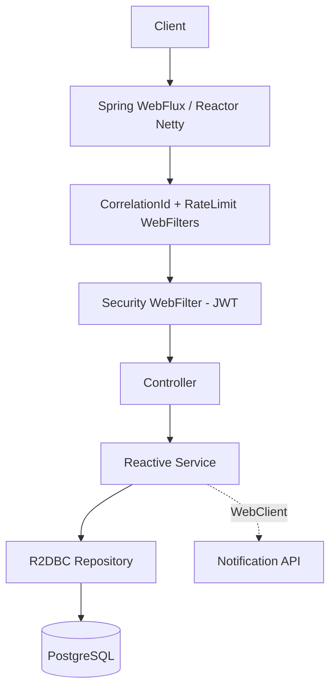
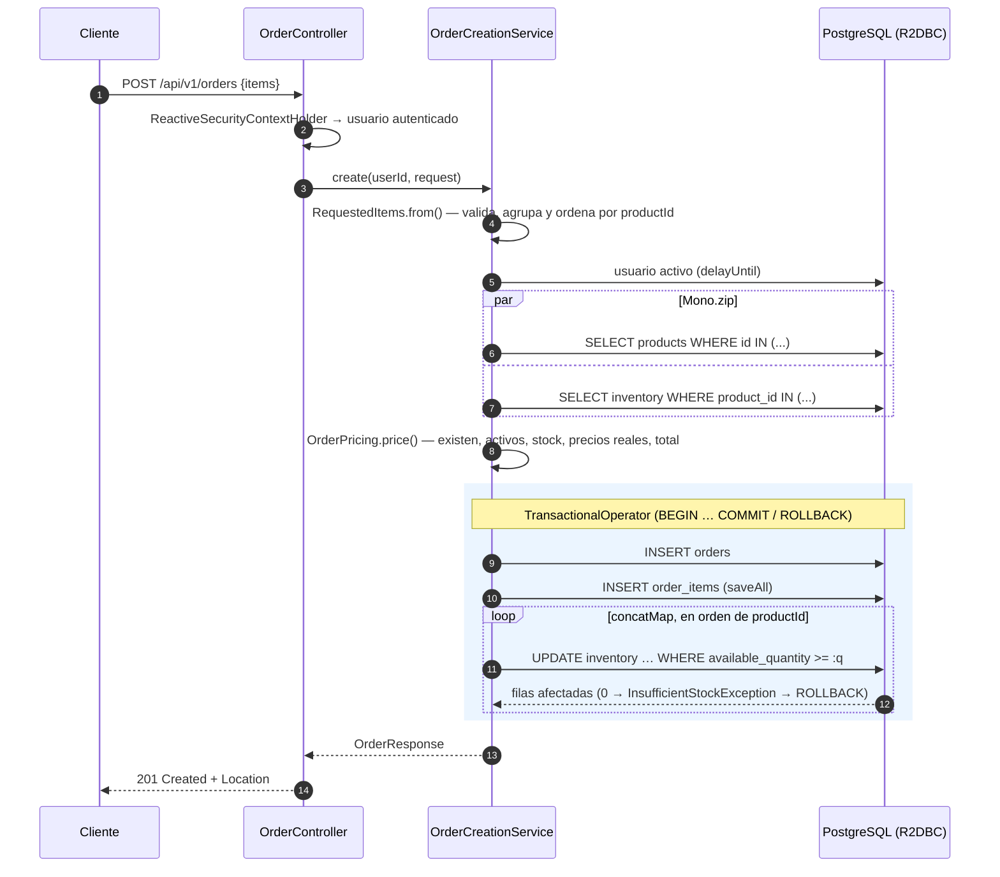

**🇪🇸 Español** | [🇬🇧 English](README.en.md)

# Reactive Order API

API REST **100 % reactiva** para gestionar los pedidos de una tienda online, construida con **Java 21**, **Spring WebFlux**, **Project Reactor** y **R2DBC** sobre **PostgreSQL**.

La reactividad no se queda en los controllers: toda la cadena, `HTTP → WebFlux → Service → R2DBC → PostgreSQL`, es no bloqueante. El proyecto muestra la composición de operaciones con Reactor, las transacciones reactivas, la gestión de stock segura ante concurrencia, WebClient con timeout y reintentos, el streaming con backpressure, la seguridad JWT adaptada a WebFlux y el testing reactivo con `StepVerifier` y Testcontainers.


---

## Índice

- [Características](#características)
- [Stack](#stack)
- [Arquitectura](#arquitectura)
- [Flujo de creación de pedidos](#flujo-de-creación-de-pedidos)
- [Requisitos](#requisitos)
- [Instalación y ejecución](#instalación-y-ejecución)
- [Variables de entorno](#variables-de-entorno)
- [Probar la API con Swagger UI](#probar-la-api-con-swagger-ui)
- [Endpoints](#endpoints)
- [JWT y seguridad reactiva](#jwt-y-seguridad-reactiva)
- [Reactive Programming](#reactive-programming)
- [Mono / Flux](#mono--flux)
- [Composición concurrente](#composición-concurrente)
- [R2DBC](#r2dbc)
- [Transacciones reactivas](#transacciones-reactivas)
- [Concurrencia de stock](#concurrencia-de-stock)
- [WebClient, timeout y retry](#webclient-timeout-y-retry)
- [Backpressure](#backpressure)
- [Streaming reactivo](#streaming-reactivo)
- [Manejo de errores](#manejo-de-errores)
- [Correlation ID, logging y observabilidad](#correlation-id-logging-y-observabilidad)
- [Testing](#testing)
- [OpenAPI](#openapi)
- [Decisiones técnicas](#decisiones-técnicas)
- [Posibles mejoras](#posibles-mejoras)
- [Autor](#autor)
- [Licencia](#licencia)

---

## Características

- **Pedidos con cálculo en el backend**: el cliente solo envía `productId` y `quantity`. Los precios, los subtotales y el total se calculan con los datos de la base de datos.
- **Transacción reactiva**: pedido, líneas y reserva de stock forman una sola unidad atómica (`TransactionalOperator`).
- **Sin overselling**: la reserva de stock es un `UPDATE ... WHERE available_quantity >= :quantity` atómico. Está probado con pedidos realmente simultáneos.
- **Máquina de estados**: `PENDING → CONFIRMED → PROCESSING → COMPLETED`, con cancelación que libera stock y control de concurrencia optimista.
- **WebClient** hacia un servicio de notificaciones, con **timeout** por intento y **retry** limitado con backoff exponencial, solo ante errores transitorios.
- **Streaming NDJSON** de productos con **backpressure** de extremo a extremo.
- **Seguridad JWT reactiva**: `SecurityWebFilterChain`, `AuthenticationWebFilter` y `ReactiveSecurityContextHolder`. Roles `USER` y `ADMIN`, y control de acceso por propietario.
- **Límite de peticiones** (429) en registro y login contra la fuerza bruta.
- **Errores consistentes** con un `ErrorWebExceptionHandler` global: 400, 401, 403, 404, 409, 422, 429, 500, 503 y 504.
- **Correlation ID** (`X-Correlation-ID`) propagado por el Context de Reactor hasta los logs y hasta las llamadas salientes.
- **Actuator** con `health`, `info` y `metrics`; los endpoints sensibles están protegidos.
- **127 tests**: unitarios con `StepVerifier`, integración con PostgreSQL real (Testcontainers), concurrencia, rollback, seguridad y WebClient.

## Stack

| Área | Tecnología |
|---|---|
| Lenguaje | Java 21 |
| Framework | Spring Boot 3.5, Spring WebFlux (Reactor Netty) |
| Programación reactiva | Project Reactor (`Mono`, `Flux`), Micrometer Context Propagation |
| Persistencia | Spring Data R2DBC, `r2dbc-postgresql`, PostgreSQL 16 |
| Migraciones | Flyway (JDBC solo al arrancar) |
| Seguridad | Spring Security (WebFlux), JJWT 0.12, BCrypt |
| Cliente HTTP | WebClient |
| Validación | Bean Validation |
| Observabilidad | Spring Boot Actuator, SLF4J + MDC |
| Documentación | springdoc-openapi (WebFlux UI) |
| Testing | JUnit 5, Mockito, Reactor Test (`StepVerifier`, `TestPublisher`), WebTestClient, Testcontainers, MockWebServer |
| Despliegue | Docker, Docker Compose, WireMock (notificaciones simuladas) |

No se usa JPA, Hibernate, JDBC para los datos de negocio, `RestTemplate` ni Lombok. Los DTOs y las entidades son `record` inmutables, así que Lombok no aportaría nada.

## Arquitectura

Organización **por dominio** (`auth`, `user`, `product`, `inventory`, `order`, `notification`). Dentro de cada dominio hay capas: `controller → service → repository`.



```text
src/main/java/com/example/reactiveorderapi/
├── config/            # Transacciones, Clock, OpenAPI, seed del admin, context propagation
├── security/
│   ├── config/        # SecurityWebFilterChain, handlers 401/403 en JSON
│   ├── jwt/           # JwtService, BearerTokenConverter, JwtAuthenticationManager
│   ├── ratelimit/     # Límite de peticiones en /api/v1/auth/**
│   ├── AuthenticatedUser.java
│   └── CurrentUser.java          # ReactiveSecurityContextHolder
├── auth/              # controller · service · dto
├── user/              # service · repository · entity · dto
├── product/           # controller · service · repository (+ búsqueda dinámica) · entity · dto
├── inventory/         # controller · service · repository (UPDATE atómicos) · entity · dto
├── order/             # controller · service (creación, pricing, estados) · repository · entity · dto
├── notification/      # NotificationClient (WebClient + timeout + retry)
├── exception/         # Excepciones de negocio + GlobalErrorWebExceptionHandler
└── common/            # ApiError, paginación, CorrelationIdFilter, políticas
```

**Principios aplicados**

- Controllers delgados: solo traducen HTTP; la lógica vive en servicios pequeños (`OrderCreationService`, `OrderService`, `InventoryService`…).
- Lógica pura separada de la E/S: `OrderPricing` y `RequestedItems` no tocan la base de datos, se prueban sin mocks y el flujo reactivo solo los orquesta.
- Inmutabilidad: entidades y DTOs son `record`; los cambios producen copias (`product.withActive(...)`).
- Inyección por constructor y `Clock` inyectado para que el tiempo sea determinista en los tests.
- Excepciones de negocio específicas, cada una con su código HTTP.

## Flujo de creación de pedidos



Los 14 pasos de la especificación en el código (`order/service/OrderCreationService.java`):

```java
return Mono.fromCallable(() -> RequestedItems.from(request))          // 2. validar items
        .delayUntil(items -> userService.requireActiveUser(userId))   // 1. usuario autenticado y activo
        .flatMap(this::priceOrder)                                     // 3-10. productos, stock, precios, total
        .flatMap(priced -> persist(userId, priced));                   // 11-14. order + items + reserva (transacción)
```

## Requisitos

- **Docker** y **Docker Compose** para ejecutar el entorno completo.
- **Java 21** para ejecutarlo en local. No hace falta instalar Maven porque se incluye el wrapper (`./mvnw`).
- Docker también es necesario para los tests de integración (Testcontainers).

## Instalación y ejecución

### Con Docker (recomendado)

```bash
git clone https://github.com/samsenpro/reactive-order-api.git
cd reactive-order-api
cp .env.example .env        # edita DB_PASSWORD, JWT_SECRET, ADMIN_EMAIL y ADMIN_PASSWORD
docker compose up --build
```

Docker Compose levanta tres servicios:

| Servicio | Puerto | Descripción |
|---|---|---|
| `reactive-order-api` | `8080` | La API. Espera a que PostgreSQL esté *healthy* y aplica las migraciones al arrancar. |
| `postgres` | interno | PostgreSQL 16 con volumen persistente y healthcheck. |
| `notification-service` | `8081` | Servicio de notificaciones simulado con **WireMock**; responde `202` a `POST /notifications`. |

- API: http://localhost:8080
- Swagger UI: http://localhost:8080/swagger-ui.html
- Health: http://localhost:8080/actuator/health
- Peticiones recibidas por el mock: http://localhost:8081/__admin/requests

Para apagarlo: `docker compose down` (conserva los datos) o `docker compose down -v` (borra también la base de datos).

### En local

```bash
docker compose up -d postgres notification-service
export DB_USERNAME=postgres DB_PASSWORD=change_me JWT_SECRET="$(openssl rand -base64 48)" \
       NOTIFICATION_SERVICE_URL=http://localhost:8081
./mvnw spring-boot:run
```

En Windows (PowerShell):

```powershell
$env:DB_USERNAME="postgres"; $env:DB_PASSWORD="change_me"; $env:JWT_SECRET="<secreto de 32+ bytes>"; $env:NOTIFICATION_SERVICE_URL="http://localhost:8081"
.\mvnw.cmd spring-boot:run
```

> Para ejecutarlo en local, publica el puerto de PostgreSQL añadiendo `ports: ["5432:5432"]` al servicio `postgres`, o usa una instancia propia.

## Variables de entorno

Todas las credenciales se leen de variables de entorno. `.env` está en `.gitignore` y **nunca** se sube al repositorio.

| Variable | Obligatoria | Descripción | Por defecto |
|---|---|---|---|
| `DB_HOST` | No | Host de PostgreSQL | `localhost` (`postgres` en Compose) |
| `DB_PORT` | No | Puerto de PostgreSQL | `5432` |
| `DB_NAME` | No | Base de datos | `reactive_orders` |
| `DB_USERNAME` | **Sí** | Usuario de la base de datos | — |
| `DB_PASSWORD` | **Sí** | Contraseña de la base de datos | — |
| `JWT_SECRET` | **Sí** | Clave HMAC de al menos 32 bytes; la app no arranca si es más corta | — |
| `JWT_EXPIRATION` | No | Validez del token en segundos | `3600` |
| `NOTIFICATION_SERVICE_URL` | No | URL del servicio de notificaciones | `http://localhost:8081` |
| `NOTIFICATION_TIMEOUT` | No | Timeout de cada intento | `2s` |
| `NOTIFICATION_MAX_RETRIES` | No | Reintentos tras el primer intento | `2` |
| `NOTIFICATION_RETRY_BACKOFF` | No | Espera inicial entre reintentos (exponencial) | `200ms` |
| `AUTH_RATE_LIMIT` | No | Peticiones por IP a `/api/v1/auth/**` por ventana | `10` |
| `AUTH_RATE_LIMIT_WINDOW` | No | Duración de la ventana | `1m` |
| `ADMIN_EMAIL` / `ADMIN_PASSWORD` | No | Administrador inicial; se crea al arrancar si no existe | — |
| `ADMIN_NAME` | No | Nombre del administrador inicial | `Administrator` |
| `APP_PORT` / `NOTIFICATION_PORT` | No | Puertos publicados por Compose | `8080` / `8081` |

Para generar un secreto: `openssl rand -base64 48`.

## Probar la API con Swagger UI

Swagger no está publicado en internet: lo sirve **tu propia instancia**. Cualquiera que clone el repositorio y ejecute `docker compose up --build` lo tendrá en http://localhost:8080/swagger-ui.html.

**1. Arranca con un administrador.** En `.env` define `ADMIN_EMAIL=admin@demo.local` y `ADMIN_PASSWORD=AdminDemo123`. La contraseña debe tener 8 caracteres o más, con al menos una mayúscula, una minúscula y un número.

**2. Crea un usuario y obtén un token**

1. **Authentication → `POST /api/v1/auth/register`** → *Try it out* → *Execute*. El cuerpo de ejemplo ya viene relleno. Respuesta: `201`.
2. **`POST /api/v1/auth/login`** con las mismas credenciales. Respuesta: `200` con `accessToken`.
3. Pulsa **Authorize** 🔓 y pega el token **sin** el prefijo `Bearer`.

**3. Crea productos (como administrador)**

1. Haz login con `ADMIN_EMAIL` / `ADMIN_PASSWORD` y autoriza Swagger con ese token.
2. `POST /api/v1/products` con `{"name": "Mechanical Keyboard", "sku": "KB-001", "price": 89.90, "initialStock": 5}` → `201`.

**4. Haz un pedido y observa el stock**

| Paso | Endpoint | Cuerpo | Resultado |
|---|---|---|---|
| Crear pedido | `POST /api/v1/orders` | `{"items":[{"productId":1,"quantity":2}]}` | `201`, `PENDING`, total calculado |
| Ver stock | `GET /api/v1/inventory/1` | — | `available` 3, `reserved` 2 |
| Sin stock | `POST /api/v1/orders` | `{"items":[{"productId":1,"quantity":10}]}` | `409 Insufficient stock` |
| Confirmar (ADMIN) | `PATCH /api/v1/orders/1/status` | `{"status":"CONFIRMED"}` | `200` + notificación enviada a WireMock |
| Cancelar | `PATCH /api/v1/orders/1/status` | `{"status":"CANCELLED"}` | `200`, el stock vuelve a `available` |

**5. Comprueba la seguridad**

| Prueba | Resultado |
|---|---|
| *Authorize → Logout* y llamar a `GET /api/v1/orders` | `401` |
| Como `USER`, `POST /api/v1/products` | `403` |
| Como otro `USER`, `GET /api/v1/orders/{id}` de un pedido ajeno | `404` |
| Como `ADMIN`, el mismo pedido | `200` |

**6. Streaming.** Swagger no representa bien los streams, así que usa curl:

```bash
curl -N -H "Authorization: Bearer $TOKEN" -H "Accept: application/x-ndjson" \
     http://localhost:8080/api/v1/products/stream
```

## Endpoints

### Authentication (público)

| Método | Ruta | Descripción | Respuesta |
|---|---|---|---|
| POST | `/api/v1/auth/register` | Registrar un usuario (`USER`) | `201` |
| POST | `/api/v1/auth/login` | Obtener un JWT | `200` `{accessToken, tokenType, expiresIn}` |

### Products

| Método | Ruta | Rol | Descripción |
|---|---|---|---|
| POST | `/api/v1/products` | ADMIN | Crear un producto y su inventario (`initialStock`) en una transacción |
| GET | `/api/v1/products?name=&sku=&active=&minPrice=&maxPrice=&page=&size=` | USER | Listado filtrado y paginado |
| GET | `/api/v1/products/stream` | USER | Productos activos en **NDJSON** |
| GET | `/api/v1/products/{id}` | USER | Detalle |
| PUT | `/api/v1/products/{id}` | ADMIN | Actualizar |
| PATCH | `/api/v1/products/{id}/activate` | ADMIN | Activar |
| PATCH | `/api/v1/products/{id}/deactivate` | ADMIN | Desactivar (deja de poder venderse) |
| DELETE | `/api/v1/products/{id}` | ADMIN | Eliminar (`409` si tiene pedidos: hay que desactivarlo) |

### Inventory

| Método | Ruta | Rol | Descripción |
|---|---|---|---|
| GET | `/api/v1/inventory/{productId}` | USER | Stock disponible y reservado |
| PATCH | `/api/v1/inventory/{productId}/add` | ADMIN | `{"quantity": n}` suma disponibles |
| PATCH | `/api/v1/inventory/{productId}/remove` | ADMIN | `{"quantity": n}` resta disponibles (`409` si quedaría negativo) |

### Orders

| Método | Ruta | Descripción |
|---|---|---|
| POST | `/api/v1/orders` | Crear un pedido (reserva stock) |
| GET | `/api/v1/orders?userId=&page=&size=` | USER: sus pedidos. ADMIN: todos, o los de `userId` |
| GET | `/api/v1/orders/{id}` | Pedido propio (USER) o cualquiera (ADMIN). Ajeno → `404` |
| PATCH | `/api/v1/orders/{id}/status` | ADMIN: cualquier transición válida. USER: solo cancelar sus pedidos `PENDING`/`CONFIRMED` |
| DELETE | `/api/v1/orders/{id}` | Eliminar un pedido `PENDING` (libera stock) o `CANCELLED` |

**Estados:**

```text
PENDING ──► CONFIRMED ──► PROCESSING ──► COMPLETED
   │            │              │
   └────────────┴──────────────┴──► CANCELLED
```

- Al **cancelar**, el stock reservado vuelve a estar disponible.
- Al **completar**, el stock reservado se descuenta definitivamente.
- Al **confirmar**, se notifica al servicio externo.

### Operacionales

| Ruta | Acceso |
|---|---|
| `/actuator/health` (+ `/liveness`, `/readiness`) | Público; los detalles solo se muestran a ADMIN |
| `/actuator/info`, `/actuator/metrics` | ADMIN |
| `/swagger-ui.html`, `/v3/api-docs` | Público |

## JWT y seguridad reactiva

La configuración está hecha para WebFlux; no es una adaptación de la de Spring MVC (`security/config/SecurityConfig.java`):

| Pieza | Qué hace |
|---|---|
| `SecurityWebFilterChain` + `ServerHttpSecurity` | Reglas de autorización por ruta y método. |
| `NoOpServerSecurityContextRepository` | **Stateless**: no se crea `WebSession` y el contexto no se guarda entre peticiones. |
| `BearerTokenConverter` | Extrae `Authorization: Bearer <token>` del `ServerWebExchange`. Sin header, la petición sigue como anónima. |
| `JwtAuthenticationManager` | Valida firma HS256, emisor y expiración, y **carga el usuario de la BD** en cada petición: bloquear o borrar una cuenta invalida sus tokens al instante. |
| `AuthenticationWebFilter` | Une los dos anteriores. Si el token no es válido responde `401` en JSON. |
| `ReactiveSecurityContextHolder` (`CurrentUser`) | Lee el usuario del **Context de Reactor**; en WebFlux no hay un `ThreadLocal` por petición. |
| `@EnableReactiveMethodSecurity` + `@PreAuthorize` | Defensa en profundidad en los endpoints de ADMIN; funciona con métodos que devuelven `Mono`. |

**Otras decisiones**

- **CSRF deshabilitado de forma justificada.** Solo se usa `Authorization: Bearer`, sin cookies de sesión, así que no hay credenciales que el navegador envíe automáticamente.
- **BCrypt fuera del event loop.** El hash (~100 ms de CPU) se calcula en `Schedulers.boundedElastic()`, tanto en el registro como en el login.
- **Sin enumeración de usuarios.** Un email inexistente, una contraseña incorrecta y una cuenta bloqueada devuelven el mismo `401 Invalid email or password`.
- **Autorización horizontal.** El id del usuario sale siempre del token. Un pedido ajeno responde `404` para no revelar qué ids existen.
- **Límite de peticiones.** Hay un máximo de peticiones por IP a `/api/v1/auth/**` (`429` + `Retry-After`).

## Reactive Programming

Cada operador se explica con el sitio del proyecto donde se usa y por qué.

| Operador | Dónde | Por qué |
|---|---|---|
| **`Mono`** | Casi todos los servicios, p. ej. `ProductService.findById` | La operación produce **0 o 1** resultado de forma asíncrona. `Mono<Void>` indica "terminó bien" sin valor, como en `InventoryService.reserve`. |
| **`Flux`** | `ProductRepository.findAllByActiveTrueOrderByIdAsc`, `OrderItemRepository.findAllByOrderId…` | **0..N** elementos que llegan a medida que la BD los envía, sin cargar la lista entera en memoria. |
| **`map`** | `productRepository.findById(id).map(ProductResponse::from)` | Transformación **síncrona** 1→1 (entidad → DTO), sin E/S. |
| **`flatMap`** | `.flatMap(priced -> persist(userId, priced))` en `OrderCreationService` | Encadena otra operación **asíncrona** que devuelve un `Mono`/`Flux`. Con `map` se obtendría un `Mono<Mono<T>>`. |
| **`filter`** | `UserService.requireActiveUser`: `.filter(User::enabled)`; `JwtAuthenticationManager`: `.filter(UserDetails::isEnabled)` | Descarta el valor si no cumple la condición: un usuario deshabilitado se convierte en un `Mono` vacío. |
| **`switchIfEmpty`** | Junto al `filter` anterior, y en cada `findById`: `.switchIfEmpty(Mono.error(() -> new ProductNotFoundException(id)))` | Convierte "no hay resultado" en un error de negocio (404). El `Mono.error` recibe un *supplier* para no crear la excepción si no se necesita. |
| **`onErrorResume`** | `OrderService.notifyIfConfirmed` | Si la notificación falla tras los reintentos, se registra y se continúa con `Mono.empty()`. Un fallo externo no deshace un pedido ya confirmado. |
| **`onErrorMap`** | `AuthService.login`, `ProductService.create` | Traduce errores técnicos a errores de dominio: `AuthenticationException` → 401 genérico; `DuplicateKeyException` → SKU duplicado (409). |
| **`timeout`** | `NotificationClient.sendOrderConfirmed` | Corta **cada intento** a los 2 s. Al cancelar la suscripción, Reactor Netty libera la conexión y no quedan recursos colgados. |
| **`retryWhen`** | `NotificationClient` con `Retry.backoff(2, 200ms).filter(isTransient)` | Reintentos **limitados**, con backoff exponencial y jitter, solo para errores transitorios. [Ver detalles](#webclient-timeout-y-retry). |
| **`zip`** | `OrderCreationService.priceOrder` y `ProductService.search` | Lanza **en paralelo** dos consultas independientes (productos e inventario; página y total) y combina los resultados cuando ambas terminan. |
| **`zipWhen`** | `OrderCreationService.persist`: `save(order).zipWhen(order -> saveItems(order.id(), …))` | La segunda operación **depende** del resultado de la primera (necesita el id generado) y se conservan ambos valores. |
| **`delayUntil`** | `.delayUntil(items -> userService.requireActiveUser(userId))` | Espera a que termine una comprobación asíncrona sin cambiar el valor que fluye. Si falla, el error corta la cadena. |
| **`collectList` / `collectMap` / `collectMultimap`** | `collectMap(Product::id)` en el pricing; `collectMultimap(OrderItem::orderId)` al paginar pedidos | Reúne un `Flux` cuando el siguiente paso necesita **todos** los elementos: calcular el total o repartir los items entre los pedidos de la página. |
| **`concatMap`** | Reservas de stock, liberación al cancelar | Procesa los elementos **uno detrás de otro y en orden**. [Ver motivo](#composición-concurrente). |
| **`limitRate`** | `ProductService.streamActiveProducts` | Controla la demanda que se pide aguas arriba. [Ver Backpressure](#backpressure). |
| **`deferContextual` / `contextWrite`** | `CorrelationIdFilter` escribe en el Context y `NotificationClient` lo lee | Pasa datos de la petición (el correlation ID) sin `ThreadLocal`. |
| **`as(transactionalOperator::transactional)`** | Creación de pedidos y productos, cambios de estado, borrados | Delimita **explícitamente** qué parte de la cadena es transaccional. |

**Qué se evita:** no hay `block()`, `Thread.sleep()`, JDBC en la lógica de negocio, `RestTemplate` ni E/S de ficheros bloqueante. Las validaciones de dominio que lanzan excepciones se envuelven en `Mono.fromCallable(...)`, de modo que llegan como **señal de error** y no como una excepción que rompe el ensamblado de la cadena.

## Mono / Flux

- `Mono<OrderResponse> create(...)`: un único pedido.
- `Mono<PageResponse<ProductResponse>> search(...)`: una página es un único valor que agrupa una lista, porque hace falta conocer el total.
- `Flux<ProductResponse> streamActiveProducts()`: un stream sin tamaño conocido de antemano.
- Los repositorios devuelven `Mono<Product> findById`, `Flux<Inventory> findAllByProductIdIn`, `Mono<Long> reserve(...)` (filas afectadas).

## Composición concurrente

La concurrencia se usa donde es segura y se evita donde podría romper la consistencia. **La consistencia del stock tiene prioridad sobre el rendimiento.**

| Operador | Uso en el proyecto | Motivo |
|---|---|---|
| `Mono.zip` | Productos ∥ inventario; página ∥ total | Son **lecturas independientes** fuera de la transacción. Cada una toma su propia conexión del pool, así que la latencia total es la de la más lenta y no la suma de ambas. |
| `concatMap` | Reservar, liberar y consumir stock | Dentro de una transacción todas las sentencias comparten **una sola conexión**; PostgreSQL no ejecuta dos sentencias a la vez en la misma conexión. Además, reservar **en orden de `productId`** hace que todos los pedidos bloqueen las filas en el mismo orden, lo que **evita deadlocks**. |
| `flatMap` | Encadenar pasos dependientes (`Mono` → `Mono`) | Composición secuencial natural de un único valor. |
| `flatMapSequential` | **No se usa, a propósito** | Serviría para cargar los items de cada pedido de una página en paralelo manteniendo el orden, pero eso son N consultas (problema N+1). Se usa **una sola** consulta `IN (...)` + `collectMultimap`. |
| `collectList` | Items guardados, página de resultados | El siguiente paso necesita la colección completa. |

## R2DBC

- **Toda** la persistencia de negocio va por **Spring Data R2DBC** con el driver no bloqueante `r2dbc-postgresql` y un pool de conexiones (`r2dbc-pool`).
- Entidades como `record` inmutables con `@Table` e `@Id`. Un id nulo indica una entidad nueva, y al guardarla R2DBC devuelve una copia con el id generado.
- **Consultas derivadas** (`findAllByUserId(Long, Pageable)`), **`@Query` + `@Modifying`** para los `UPDATE` atómicos de stock, y **`R2dbcEntityTemplate` + `Criteria`** para la búsqueda con filtros opcionales (`ProductSearchRepository`). Los valores van siempre como parámetros enlazados y los comodines de `LIKE` se escapan.
- R2DBC no tiene `Page`: la paginación usa `LIMIT/OFFSET` con un orden fijo en el servidor, y el total se consulta en paralelo.

**Flyway y la separación JDBC/R2DBC.** Flyway solo funciona sobre JDBC, así que se configura con su propia URL (`spring.flyway.url=jdbc:postgresql://...`) y se ejecuta **una vez al arrancar**, antes de aceptar peticiones. Spring Boot **no crea un `DataSource`** cuando existe un `ConnectionFactory` de R2DBC, así que ningún servicio puede usar JDBC por error. El health de Actuator solo muestra el indicador `r2dbc`.

Migraciones (`src/main/resources/db/migration`):

- **Tablas**: `users`, `products`, `inventory`, `orders`, `order_items`.
- **Índices**: `users.email` (único), `products.sku` (único), `products.active`, `inventory.product_id` (único), `orders.user_id`, `orders.status` y `order_items.order_id`.
- **Restricciones CHECK**: precio > 0, stock ≥ 0, subtotal = cantidad × precio, estados válidos.

## Transacciones reactivas

Las transacciones de Spring MVC (`@Transactional` sobre JDBC) dependen de un `ThreadLocal` que guarda la conexión. En WebFlux una misma petición puede cambiar de hilo en cada operador, así que ese mecanismo no sirve.

El proyecto usa **`TransactionalOperator`** sobre el **`R2dbcTransactionManager`** (un `ReactiveTransactionManager`):

```java
return orderRepository.save(Order.pending(userId, total, now))
        .zipWhen(order -> saveItems(order.id(), priced))          // INSERT order_items
        .delayUntil(saved -> reserveStock(saved.getT1().id(), priced))  // UPDATE inventory …
        .map(saved -> OrderResponse.from(saved.getT1(), saved.getT2()))
        .as(transactionalOperator::transactional);
```

**Cómo funciona:**

1. Al suscribirse, el operador obtiene una conexión del pool, ejecuta `BEGIN` y guarda la conexión en el **Context de Reactor**, no en un `ThreadLocal`.
2. Todos los repositorios que se ejecutan dentro de esa cadena encuentran la conexión en el Context y la **reutilizan**, sea cual sea el hilo.
3. Si la cadena termina con éxito, ejecuta `COMMIT`. Si llega **cualquier señal de error**, por ejemplo `InsufficientStockException` en la segunda reserva, ejecuta `ROLLBACK`. También hace `ROLLBACK` si el cliente **cancela** la petición.

El caso que se evita (pedido creado → items creados → falla el stock → datos inconsistentes) está **probado con PostgreSQL real** en `StockConcurrencyIntegrationTest.failedReservationRollsBackOrderItemsAndPreviousReservations`:

- 10 pedidos simultáneos piden A (abundante) y B (1 unidad).
- Los logs muestran **10 reservas de A** dentro de las transacciones, pero solo 1 de B.
- Al final hay **1 pedido**, **1 línea** y A tiene exactamente **1 unidad reservada**: las otras 9 transacciones se deshicieron por completo.

Solo las escrituras van dentro de la transacción. Las lecturas previas (productos e inventario) se hacen fuera y en paralelo, para que la transacción sea lo más corta posible.

## Concurrencia de stock

**El problema.** Con stock 5, los usuarios A y B piden 4 unidades a la vez. El patrón ingenuo es `SELECT stock → if (stock >= 4) → UPDATE`: ambos leen 5, ambos pasan la comprobación y el stock termina en −3.

**La solución.** La comprobación y la modificación son **una única sentencia atómica** (`inventory/repository/InventoryRepository.java`):

```sql
UPDATE inventory
   SET available_quantity = available_quantity - :quantity,
       reserved_quantity  = reserved_quantity + :quantity,
       updated_at         = now()
 WHERE product_id = :productId
   AND available_quantity >= :quantity
```

**Por qué es seguro:**

- PostgreSQL toma un **bloqueo de fila** para el `UPDATE`. Si dos transacciones compiten, la segunda **espera** a que la primera termine y después **vuelve a evaluar el `WHERE`** con el valor ya actualizado.
- Si ya no queda stock, el `UPDATE` afecta **0 filas**. El servicio lo detecta y emite `InsufficientStockException` (409), lo que provoca el rollback de todo el pedido.
- Como última línea de defensa, la tabla tiene `CHECK (available_quantity >= 0)`.
- Las reservas se hacen **ordenadas por `productId`** para evitar deadlocks entre pedidos con varios productos.
- Los cambios de estado usan **concurrencia optimista**: `UPDATE orders SET status = :target WHERE id = :id AND status = :expected`. Así, dos cancelaciones simultáneas no pueden liberar el stock dos veces (la segunda recibe `409`).

La comprobación de stock previa (`OrderPricing`) es solo un **fallo rápido** que da un buen mensaje de error. La garantía real está en el `UPDATE`.

**Probado** en `StockConcurrencyIntegrationTest` con peticiones HTTP realmente paralelas:

- Stock 5 y 2 × 4 unidades → 1 pedido creado y 1 rechazado (`409`); queda 1 unidad.
- Stock 10 y 25 pedidos simultáneos de 1 unidad → exactamente 10 creados y 15 rechazados; stock final 0, nunca negativo.

## WebClient, timeout y retry

Cuando un pedido pasa a `CONFIRMED`, `NotificationClient` hace `POST /notifications` al servicio externo. En Docker es un mock de WireMock.

```java
Mono.deferContextual(ctx -> webClient.post().uri("/notifications")
            .header("X-Correlation-ID", ctx.getOrDefault("correlationId", ""))
            .bodyValue(notification)
            .retrieve()
            .toBodilessEntity()
            .timeout(properties.timeout()))                       // por intento
    .retryWhen(Retry.backoff(maxRetries, backoff).filter(NotificationClient::isTransient))
```

| Aspecto | Decisión |
|---|---|
| **Timeout** | 2 s **por intento** (`timeout` antes de `retryWhen`), más `responseTimeout` y un timeout de conexión en Reactor Netty. Al vencer, se cancela la suscripción y se libera la conexión. |
| **Qué operación tiene retry** | Solo la notificación. **Nunca** las escrituras de pedidos o stock: reintentarlas podría duplicar efectos. |
| **Por qué** | Es una llamada de red a un tercero: los fallos transitorios (red, reinicios, sobrecarga) son esperables y un reintento suele resolverlos. |
| **Cuántos intentos** | 1 intento + **2 reintentos** (configurable), con backoff exponencial desde 200 ms y jitter. Nunca son infinitos. |
| **Qué errores se reintentan** | `TimeoutException`, errores de conexión (`WebClientRequestException`), **5xx** y **429**. |
| **Qué errores NO se reintentan** | **400, 401, 403, 404** y el resto de 4xx: repetir una petición incorrecta o no autorizada no la arregla. |
| **Tras agotar los intentos** | `NotificationDeliveryException`. `OrderService` la captura con `onErrorResume`, registra `External notification failure orderId=… userId=…` y el pedido **sigue confirmado**. |

Verificado en vivo con Docker: con WireMock respondiendo en 5 s, la confirmación tardó ~6,9 s (3 intentos de 2 s + backoff), devolvió `200 CONFIRMED` y WireMock registró exactamente 3 peticiones.

## Backpressure

**¿Qué es?** Es la capacidad del **consumidor** de indicar al **productor** cuántos elementos puede procesar. En Reactive Streams el suscriptor pide `request(n)` y el productor no puede emitir más de `n`.

**¿Por qué importa?** Sin backpressure, un productor rápido (una tabla con millones de filas) desborda a un consumidor lento (un cliente móvil con mala conexión). La aplicación acumula datos en memoria hasta quedarse sin heap, o tiene que descartarlos.

**¿Cómo lo maneja Reactor en este proyecto?** Con `GET /api/v1/products/stream`:

```text
Cliente HTTP lento ◄── TCP (ventana) ◄── Reactor Netty ◄── limitRate(50) ◄── Flux R2DBC ◄── PostgreSQL
```

1. Reactor Netty solo pide más elementos al `Flux` cuando ha podido escribir los anteriores en el socket. Si el cliente lee despacio, el buffer TCP se llena y la demanda se detiene.
2. `limitRate(50)` convierte esa demanda en peticiones **acotadas** a la fuente: pide 50 filas y repone cuando se ha consumido el 75 %. Nunca pide `Long.MAX_VALUE`, es decir, "todo".
3. El driver R2DBC de PostgreSQL traslada la demanda al protocolo y **solo lee de la BD las filas pedidas**.

El resultado es que la memoria usada es constante, sea cual sea el tamaño de la tabla. El test `ProductServiceTest.Stream.consumerDemandIsPropagatedInBoundedBatches` usa un `TestPublisher` para comprobar que el suscriptor pide 2 elementos y la fuente nunca recibe una demanda mayor que el lote, y que la cancelación llega hasta la fuente.

**Operadores que influyen en la backpressure**

| Operador | Efecto |
|---|---|
| `limitRate(n)` | Acota y agrupa la demanda que sube. Es el que usa este proyecto. |
| `buffer`, `window` | Agrupan elementos y cambian la granularidad de la demanda. |
| `flatMap(f, concurrency, prefetch)` | La concurrencia y el *prefetch* determinan cuántos elementos pide por adelantado. |
| `concatMap` | Procesa uno a uno: la demanda es mínima. |
| `publishOn(scheduler, prefetch)` | Introduce una cola con capacidad *prefetch* al cambiar de hilo. |
| `onBackpressureBuffer`, `onBackpressureDrop`, `onBackpressureLatest` | Estrategias para fuentes que **no** respetan la demanda (eventos, *hot publishers*): acumular, descartar o quedarse con el último. |

Aquí no se usa `onBackpressure*` porque la fuente, la base de datos, **sí** respeta la demanda. No hace falta descartar ni acumular.

## Streaming reactivo

`GET /api/v1/products/stream` devuelve `Flux<ProductResponse>` como **`application/x-ndjson`**: un objeto JSON por línea, enviado en cuanto está disponible.

Un endpoint de streaming es útil porque:

- El cliente empieza a procesar el primer elemento sin esperar al último (menor *time-to-first-byte*).
- El servidor no construye una lista gigante en memoria (con la backpressure descrita arriba).
- Sirve para exportaciones, sincronización de catálogos o integraciones que consumen datos incrementalmente.

Se eligió NDJSON en lugar de Server-Sent Events porque cada línea es un JSON autónomo, fácil de consumir con `curl`, `jq` o cualquier lenguaje, y no hace falta mantener la conexión abierta para eventos futuros.

## Manejo de errores

`GlobalErrorWebExceptionHandler` implementa `ErrorWebExceptionHandler` con `@Order(-2)`, antes que el de Spring Boot. Cubre los errores de los controllers **y** los de los `WebFilter`. Los handlers de seguridad (401/403) usan el mismo `ApiErrorWriter`, así que todas las respuestas tienen el mismo formato:

```json
{
  "timestamp": "2026-09-23T20:00:00Z",
  "status": 404,
  "error": "NOT_FOUND",
  "message": "Product not found: 100",
  "path": "/api/v1/products/100",
  "correlationId": "4c1f0c7e-2b8a-4a57-9a8e-8f5b1e2d9c10"
}
```

| Código | Origen |
|---|---|
| `400` | Bean Validation (con `errors[]` por campo), JSON mal formado, parámetros inválidos, rango de precios incoherente |
| `401` | Sin token, token inválido o expirado, cuenta bloqueada, credenciales incorrectas |
| `403` | Rol insuficiente (`AccessDeniedException`) |
| `404` | `ProductNotFoundException`, `OrderNotFoundException` (también para pedidos ajenos), `UserNotFoundException` |
| `409` | `InsufficientStockException`, `DuplicateResourceException` (email/SKU), `ProductInUseException`, `OrderConflictException` |
| `422` | `ProductInactiveException`, `InvalidOrderException`, `InvalidStatusTransitionException` |
| `429` | `RateLimitExceededException` (+ cabecera `Retry-After`) |
| `500` | Error inesperado: se registra con stack trace en el log; el cliente recibe un mensaje genérico |
| `503` | Base de datos no disponible (`DataAccessResourceFailureException`, errores R2DBC transitorios) |
| `504` | `TimeoutException` de una operación aguas abajo |

**Nunca** se exponen stack traces ni mensajes internos.

## Correlation ID, logging y observabilidad

**Correlation ID.** `CorrelationIdFilter` es el primer `WebFilter`:

- Conserva el `X-Correlation-ID` del cliente si es válido (`[A-Za-z0-9._-]{1,64}`, lo que evita inyecciones en logs). Si no, genera un UUID.
- Lo devuelve en la cabecera de la respuesta y en el cuerpo de los errores.
- Lo guarda en el **Context de Reactor**. Con `spring.reactor.context-propagation=auto` y un `ThreadLocalAccessor` registrado (`ContextPropagationConfig`), Micrometer lo copia al **MDC** en cada operador, sea cual sea el hilo.
- `NotificationClient` lo reenvía al servicio externo, lo que permite seguir una petición entre sistemas.

```text
INFO [cid:abc-123] ... OrderService : Order status changed orderId=3 userId=10 PENDING -> CONFIRMED
WARN [cid:abc-123] ... NotificationClient : Retrying notification orderId=3 attempt=1 cause=TimeoutException
```

**Eventos registrados** (con `orderId`/`userId`): usuario registrado, login, pedido creado, stock reservado/liberado/consumido, pedido confirmado, cambio de estado, reintentos y fallo de notificación externa.

**Datos que nunca se registran:** contraseñas, JWT, la cabecera `Authorization` ni secretos. Los `toString()` de los DTOs y entidades sensibles los omiten.

**Actuator**

| Endpoint | Acceso | Contenido |
|---|---|---|
| `health` | Público | Estado general; `liveness`/`readiness` para orquestadores. Los detalles (R2DBC, disco) solo los ve ADMIN. |
| `info` | ADMIN | Versión y *build* (`build-info`), Java, SO y descripción de la app |
| `metrics` | ADMIN | Métricas de JVM, HTTP (`http.server.requests`), pool R2DBC… |

## Testing

```bash
./mvnw test     # 127 tests; Docker debe estar en ejecución
```

**Unitarios (84): JUnit 5 + Mockito + Reactor Test**

| Clase | Qué prueba |
|---|---|
| `ProductServiceTest` | **Mono**: éxito, vacío → 404, error del repositorio. **Flux**: varios elementos, vacío, error a mitad del stream, **backpressure** con `TestPublisher`. Búsqueda con `zip`, SKU duplicado, borrado con FK |
| `InventoryServiceTest` | Reserva atómica OK/insuficiente; diferencia entre "sin stock" y "producto inexistente" |
| `OrderCreationServiceTest` | Flujo completo dentro de la transacción; **orden de reservas** (`InOrder`); error de reserva propagado (rollback); producto inexistente o inactivo; usuario inválido; la validación llega como señal de error |
| `OrderServiceTest` | Acceso propio/ajeno/admin; paginación sin N+1; cancelar libera y completar consume stock; transición inválida; USER no puede confirmar; conflicto optimista; fallo de notificación tolerado |
| `OrderPricingTest`, `RequestedItemsTest`, `OrderStatusTest` | Lógica pura: precios, redondeo, agrupación de líneas, límites y máquina de estados |
| `NotificationClientTest` | **WebClient** contra `MockWebServer`: éxito, **timeout**, **error 500**, **retry**, **éxito tras el retry**, sin retry en 400 y propagación del correlation ID |
| `AuthServiceTest`, `JwtServiceTest`, `JwtAuthenticationManagerTest` | Registro, login genérico, carrera de emails duplicados; JWT expirado, manipulado, con otra clave o de otro emisor; usuario bloqueado o borrado |
| `FixedWindowRateLimiterTest`, `CorrelationIdFilterTest` | Ventanas del limitador; correlation ID en el Context de Reactor |

**Integración (43): Testcontainers + WebTestClient.** Se levanta **PostgreSQL 16 real** en un contenedor (no H2) y la aplicación completa en un puerto aleatorio. `@ServiceConnection` configura a la vez R2DBC y Flyway (JDBC), y el mismo contenedor se comparte entre las clases.

| Clase | Qué prueba |
|---|---|
| `AuthIntegrationTest` | Registro, duplicados, validación, login, errores genéricos, correlation ID |
| `ProductIntegrationTest` | Crear (con inventario), consultar, actualizar, borrar, filtros + paginación, `LIKE` escapado, **stream NDJSON**, producto con pedidos |
| `InventoryIntegrationTest` | Crear inventario, añadir y retirar stock, nunca negativo, permisos |
| `OrderIntegrationTest` | Crear pedido, **precio del cliente ignorado**, reservar stock, consultar, **actualizar estado** hasta `COMPLETED`, **notificación recibida** con correlation ID, fallo de notificación tolerado (3 intentos), cancelar, transiciones inválidas, borrado |
| `StockConcurrencyIntegrationTest` | **Overselling imposible** con peticiones HTTP paralelas y **rollback completo** de las transacciones perdedoras |
| `SecurityIntegrationTest` | Sin JWT → 401 · JWT inválido o manipulado → 401 · USER en endpoints permitidos → 200 · USER en endpoint ADMIN → 403 · USER con pedido propio → 200 · USER con pedido ajeno → 404 · ADMIN con pedido ajeno → 200 · Actuator y Swagger |
| `AuthRateLimitIntegrationTest` | `429` + `Retry-After` al superar el límite |

**Por qué `MockWebServer` y no WireMock en los tests:** es una dependencia pequeña que levanta un servidor HTTP real y permite encolar respuestas (`500` y luego `202`) y retrasarlas para provocar timeouts, que es justo lo que hace falta para probar `timeout` y `retryWhen`. WireMock se usa en Docker Compose, donde su imagen oficial permite simular el servicio sin escribir código.

## OpenAPI

- Swagger UI en `/swagger-ui.html` y especificación en `/v3/api-docs` (springdoc para WebFlux).
- Esquema **Bearer JWT** configurado: el botón *Authorize* permite probar los endpoints protegidos.
- **Ejemplos de request** en todos los DTOs (`@Schema(example = ...)`).
- **Ejemplos de error** 400/401/403/404/409/422/500 añadidos a **todas** las operaciones con un `OperationCustomizer`, usando el formato real de `ApiError`.
- La descripción de la API explica cómo autenticarse.

## Decisiones técnicas

| Decisión | Motivo |
|---|---|
| `TransactionalOperator` explícito en lugar de `@Transactional` | Deja visible en el código qué parte de la cadena es atómica y facilita probarlo. |
| `UPDATE` condicional en lugar de `SELECT FOR UPDATE` o bloqueos optimistas con versión | Resuelve comprobar y reservar en un solo viaje a la BD, sin mantener bloqueos entre sentencias y sin reintentos. |
| Pre-chequeo de stock + `UPDATE` atómico | El primero da un buen mensaje de error y evita abrir transacciones inútiles; el segundo es la garantía real. |
| Reservas en orden de `productId` | Orden de bloqueo global → sin deadlocks. |
| Pedido ajeno → `404` en lugar de `403` | No revela qué ids de pedido existen. |
| Notificación después del `COMMIT` y *best effort* | Un servicio externo caído no debe impedir confirmar pedidos, y la llamada no se hace con la transacción abierta. |
| Carga del usuario en cada petición JWT | Bloquear o borrar una cuenta tiene efecto inmediato, a cambio de una consulta indexada por petición. |
| Flyway por JDBC solo al arrancar | Es la herramienta estándar y fiable; no hay `DataSource` en tiempo de ejecución. |
| Paginación con orden fijo en el servidor | No se puede ordenar por columnas arbitrarias ni internas. |
| Seed del admin con `ApplicationReadyEvent` y sin `block()` | Arranque totalmente reactivo; los tests esperan a su finalización con `completion()`. |
| Limitador en memoria | Suficiente para una instancia; documentado cómo escalarlo. |
| Records inmutables sin Lombok | El lenguaje ya resuelve lo que aportaría Lombok. |

## Posibles mejoras

- **Outbox pattern** para las notificaciones: guardar el evento en la misma transacción del pedido y publicarlo de forma asíncrona, con garantía de entrega *at-least-once*.
- **Idempotency-Key** en `POST /orders` para que un reintento del cliente no cree pedidos duplicados.
- **Circuit breaker** (Resilience4j) delante del servicio de notificaciones.
- **Rate limiting distribuido** (Redis o API gateway) para varias réplicas.
- **Caducidad de reservas**: liberar automáticamente el stock de pedidos `PENDING` abandonados.
- **Paginación por cursor (keyset)** para listados muy grandes, en lugar de `OFFSET`.
- **Refresh tokens** con rotación y revocación.
- **BlockHound** en los tests para detectar automáticamente llamadas bloqueantes en hilos del event loop.
- **Trazas distribuidas** (Micrometer Tracing + OpenTelemetry) y métricas de negocio (pedidos por estado, fallos de stock).
- **Pipeline de CI** (GitHub Actions) con tests, análisis estático y escaneo de dependencias.

## Autor

- **LinkedIn:** [samuel-martinez-beleno](https://www.linkedin.com/in/samuel-martinez-beleno/)
- **GitHub:** [samsenpro](https://github.com/samsenpro)

## Licencia

Distribuido bajo la licencia [MIT](LICENSE).
